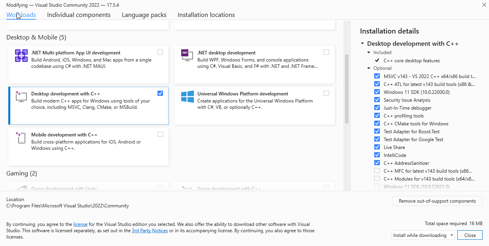
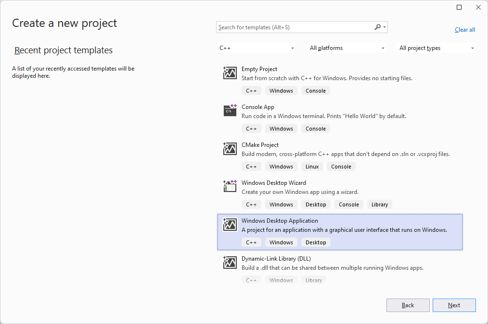
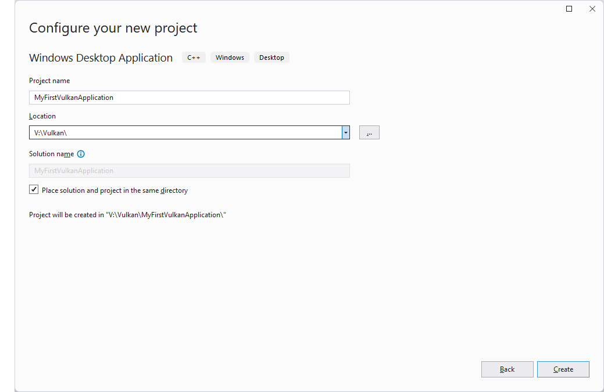
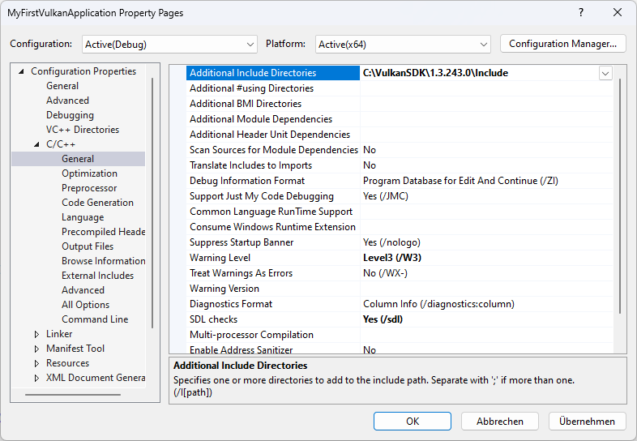
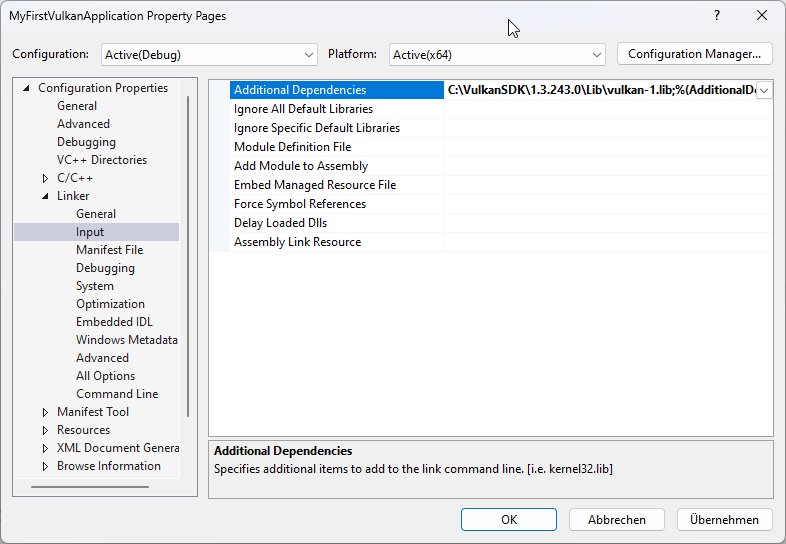
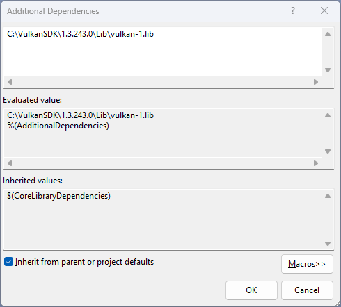

// Copyright 20230 The Khronos Group, Inc.
// SPDX-License-Identifier: CC-BY-4.0

ifndef::chapters[:chapters:]
ifndef::images[:images: images/]
:pp: 

[[development-environment]]
= Development Environment

== Intro

Vulkan supports many xref:platforms.adoc[Platforms] and as such can be used with different developer environments. This chapter shows how to setup some common developer environment so that you can start writing Vulkan applications. It's meant as a fast track to get your first Vulkan project up and running on your desired platform, which means that it'll make use of platform specific stuff and does not get into cross platform Vulkan applications. Note that there are Vulkan bindings for a lot of programming language but for this chapter we'll concentrate on C/C++.

== Windows

=== Prerequisites

To write and run Vulkan applications you need the Vulkan headers and a xref:loader[Vulkan loader]. To help tracking down problems and errors xref::validation_overview[validation layers] are recommended. The link:https://www.lunarg.com/vulkan-sdk/[LunarG Vulkan SDK] bundles all these requisites and makes them easy to setup. It's therefore recommended to install the SDK.

=== Visual Studio

Vulkan development on Windows can be done with any edition of Visual Studio, including the free link:https://visualstudio.microsoft.com/en/vs/community/[Community Edition].

Writing Vulkan applications in C/C\++ requires the "Desktop development with C\++" workload to be installed:



Next create a new "Windows Desktop Application":





Next we need to setup the Vulkan headers and libraries. The base path depends on the LunarG SDK Version you have installed, we'll be using 1.3.243.0, so our base path is `C:\VulkanSDK\1.3.243.0`.

Open the project settings via `Project -> Settings` (ALT+F7), select `C/C++` and add the `include` folder of the SDK install path:



Next go to the `Input` section of the `Linker` settings and add the `vulkan-1.lib` from the `Lib` folder of the SDK install path by clicking on the drop down arrow in `Additional Dependencies`:





Your project is now ready to use Vulkan.

Go to the main unit of your project (in our case `MyFirstVulkanApplication`) and include the Vulkan headers at the top of the file.

Change

```cpp
#include "framework.h"
#include "MyFirstVulkanApplication.h"
```

to

```cpp
#include "vulkan/vulkan.h"
#include "framework.h"
#include "MyFirstVulkanApplication.h"
```

Next navigate to the `wWinMain` function and add code for creating the Vulkan instance below the `// TODO: Place code here.` comment:

```cpp
int APIENTRY wWinMain(_In_ HINSTANCE hInstance,
                     _In_opt_ HINSTANCE hPrevInstance,
                     _In_ LPWSTR    lpCmdLine,
                     _In_ int       nCmdShow)
{
    UNREFERENCED_PARAMETER(hPrevInstance);
    UNREFERENCED_PARAMETER(lpCmdLine);

    // TODO: Place code here.
    VkInstance instance;
    VkInstanceCreateInfo instanceCreateInfo{};
    instanceCreateInfo.sType = VK_STRUCTURE_TYPE_INSTANCE_CREATE_INFO;
    VkResult result = vkCreateInstance(&instanceCreateInfo, nullptr, &instance);
    if (result != VK_SUCCESS) {
        exit(-1);
    }

    // ...
}
```

Now run the application, and if you see the window it means Vulkan was properly setup and the application was able to create the Vulkan instance, which is the base for any Vulkan application.

=== Visual Studio Code

== Linux

== Android

=== Prerequisites

=== Android Studio

== MacOS

=== XCode

== Build systems

=== CMake

@todo: e.g. cmake